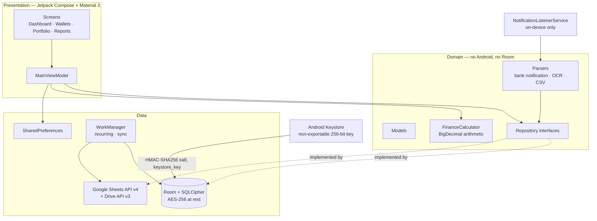

# DompetKu (Sisa Uang)

A native Android personal-finance app: offline-first, encrypted at rest, and built for Indonesian users — IDR currency, Bahasa Indonesia UI throughout.

The interesting engineering problem here is not the CRUD. It is that a personal finance app holds the most sensitive data a phone carries, so the storage layer has to be genuinely secure rather than nominally secure, and the automation features have to stay on the right side of Google Play policy.

**Package ID:** `com.sisaus.sisauang`

---

<!--
## Screenshots

Ambil screenshot dari emulator atau HP fisik (data contoh dari Onboarding),
simpan ke docs/screenshots/, lalu hapus tanda komentar ini.

| Dashboard | Input Transaksi |
|---|---|
|  |  |

| Portofolio | Draft Notifikasi |
|---|---|
|  |  |
-->

## Features

- **Offline-first with SQLCipher encryption** — all financial data is encrypted locally via Room + SQLCipher. The database passphrase is derived at runtime from a hardware-backed Android Keystore key; it is never stored on disk and there is no hardcoded fallback.
- **PIN + biometric lock** — layered protection with automatic lock when the app is backgrounded.
- **Exact arithmetic** — all financial calculations use `BigDecimal`, avoiding float/double rounding drift.
- **Wallets** — manage bank accounts, e-wallets, cash, credit cards, brokerage accounts, deposits and custom wallets side by side.
- **Fast entry** — enter amounts as expressions (`25000 + 15000`), pick a category, add tags, save.
- **Notification automation** — bank/e-wallet notifications are parsed **on-device** into *draft* transactions. Requires explicit user consent, and every draft must be confirmed — nothing auto-commits.
- **CSV import** — import transactions from bank/spreadsheet CSVs with configurable column templates.
- **Receipt OCR** — scan a receipt; amount and note are extracted as a draft.
- **Budgets & savings goals** — per-category budgets per period, with progress tracking.
- **Investment portfolio** — track equities, mutual funds, bonds, gold, crypto and deposits on one screen.
- **Recurring transactions** — schedule salary, bills and instalments.
- **Reports & forecasting** — surplus/deficit trend charts, per-category reports, cash-flow forecast.
- **Local backup (CSV)** — export/import all transactions to CSV without needing the internet.
- **Cloud sync (Google Sheets + Drive)** — two-way sync to a spreadsheet in the user's own Google account; full database backup to Google Drive.

---

## Architecture



The dependency rule points one way: **Domain knows nothing about Room or Google.** The data layer implements the interfaces the domain declares, which is what makes the storage layer swappable and testable without a device.

The database passphrase is derived at launch from a hardware-backed key, so it is never stored and there is no hardcoded fallback. If SQLCipher cannot be initialised the app refuses to start rather than silently writing plaintext.

The presentation layer is a single `MainViewModel` connecting the Compose screens, backed by a hand-rolled `AppContainer` for dependency wiring.

---

## Security Design

Worth calling out, because the defaults matter:

| Concern | Approach |
|---|---|
| Data at rest | Room + SQLCipher, AES-256 |
| Passphrase | Derived at launch as `HMAC-SHA256(salt, keystore_key)`; key is a non-exportable 256-bit key in the Android Keystore, salt is 32 random bytes in app-private storage |
| App access | PIN (SHA-256 hashed) + biometric prompt, auto-lock on background |
| Notification parsing | 100% on-device; nothing sent to a third-party server |
| Automation output | Always a draft requiring explicit confirmation |

There is deliberately **no hardcoded fallback passphrase**. An earlier revision shipped a constant default when the Keystore was unavailable; that has been removed, because a constant key shipped in the APK makes the encryption decorative. Tests that need deterministic keys now inject a passphrase explicitly rather than relying on a production default.

If SQLCipher cannot be initialised, the app now **refuses to start** rather than falling back to plain SQLite. A silent fallback would write financial data unencrypted while the UI still claimed otherwise; failing loudly is the honest behaviour.

**One caveat worth stating plainly:** the app currently calls `fallbackToDestructiveMigration()`, which drops and recreates the database if the schema version changes without a migration. For a v1 app that is a reasonable trade — but any future schema change would silently wipe user data, so that call should be replaced with real migrations before the app ships an update to existing users.

---

## Google Play Compliance

The notification-automation feature is the part that most often gets an app rejected, so the choices here are deliberate:

- No `READ_SMS` / `RECEIVE_SMS`
- No `QUERY_ALL_PACKAGES`
- No `AccessibilityService` scraping of other apps
- `NotificationListenerService` activates only with explicit user consent, with full disclosure before activation
- All notification processing is local to the device
- Every automated input produces a **draft** the user must confirm — there is no auto-commit path

---

## Technology

| Component | Technology |
|---|---|
| Language | Kotlin |
| UI | Jetpack Compose + Material 3 |
| Database | Room + SQLCipher (encryption) |
| Background | WorkManager |
| Auth | Google Sign-In (OAuth2) |
| Cloud sync | Google Sheets API v4 + Drive API v3 |
| HTTP | OkHttp |
| Build | Gradle KTS + KSP |

---

## Building

**Prerequisites:** Android Studio (or the Android SDK + JDK 11+).

```bash
git clone https://github.com/rrsynt/SisaUang.git
cd SisaUang
./gradlew assembleDebug
```

The debug build works out of the box. A release build needs a signing keystore, configured via environment variables rather than a committed file:

```bash
export KEYSTORE_PATH=/path/to/upload-key.jks
export STORE_PASSWORD=...
export KEY_PASSWORD=...
./gradlew assembleRelease
```

`local.properties` (which points at your local SDK) and `*.jks` / `*.keystore` are gitignored.

### Optional: Gemini API key

`GEMINI_API_KEY` is read from `.env` via the Secrets Gradle Plugin. Copy `.env.example` to `.env` and fill it in if you want the AI-backed features; everything else runs without it.

---

## Trying It Out

1. **Onboarding** — choose *Isi Data Contoh* to start with dummy data, or *Mulai dari Nol* for an empty database.
2. **Add a wallet** — Wallet tab → `+` → name, type, opening balance.
3. **Record a transaction** — floating `+` → amount (expressions work) → category & wallet → Save.
4. **Local backup** — Settings → *Backup & Restore Lokal (CSV)* → *Ekspor ke File CSV*.
5. **Cloud sync** — Settings → *Sinkronisasi Cloud* → sign in with Google → enter or auto-create a spreadsheet ID → Sync.

---

## Docs

Design documents live in `docs/`: `BRD.md` (business requirements), `PRD.md` (product requirements), `SRS.md` (software requirements).
